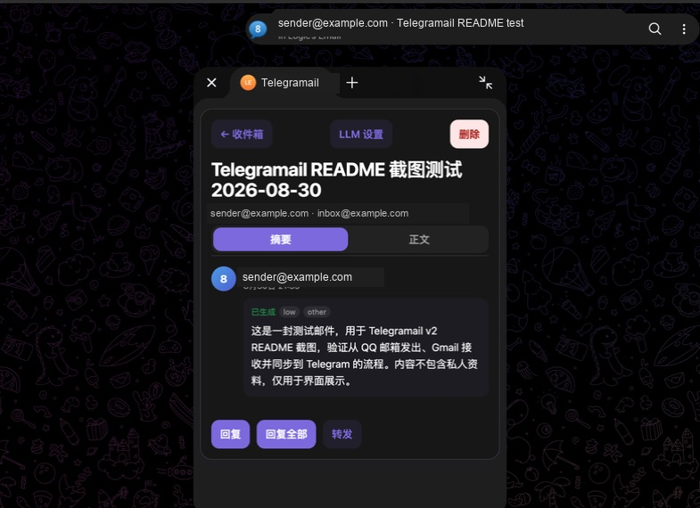

# Telegramail

[English](./README.md)

Telegramail 把邮箱放进 Telegram。一个自托管服务可以同时连接多个 IMAP/SMTP 邮箱，通过 Bot 推送新邮件，并用 Mini App 完成阅读、写信、回复和转发。



## Telegramail 适合你吗？

Telegramail 面向个人用户：你经常使用 Telegram，需要管理多个邮箱，并且愿意在自己的服务器上运行 Docker。

它不是团队共享邮箱，也不是多人邮件服务。Telegram 中同步出的副本可以托底，但不能替代对本地 `data/` 目录的备份。

## 为什么选择 Telegramail？

- **在 Telegram 里轻量管理多个邮箱。** 新邮件直接进入 Telegram；长邮件、附件、写信、回复、转发和账户设置则交给 Mini App。
- **自托管，数据由自己掌控。** 邮箱凭据使用你的主密钥加密，凭据和邮件索引数据保存在服务器本地的 SQLite 数据库中。
- **在 Telegram 中多一份副本。** Telegramail 会把已同步的邮件和支持的附件发送到 Telegram。即使源邮箱以后失效，已经送达 Telegram 的副本仍可在那里回看；超出 Telegram 投递限制的内容则只保留在本地。

Telegramail 只使用 Telegram Bot API 和 Mini App，不需要你的个人 Telegram 手机号、API ID、API Hash 或 TDLib 会话。

## 支持的功能

- 同时连接 Gmail、QQ 邮箱、Outlook/Microsoft 365、iCloud 和自定义 IMAP/SMTP 邮箱
- 按可配置间隔检查新邮件，并用每个邮箱独立的 UID 游标避免重复收取
- 写信、回复、转发、抄送/密送、Markdown、签名和附件
- 通过 OpenAI-compatible 服务生成可选的摘要、分类和重要链接
- 加密保存邮箱凭据，邮件数据存入本地 SQLite

## 使用构建好的镜像快速启动

你需要：

- Docker Compose
- 通过 [@BotFather](https://t.me/BotFather) 创建的 Telegram Bot
- Cloudflare 账户，以及一个已经接入 Cloudflare 的域名

### 1. 创建 Cloudflare Tunnel 并取得 token

1. 打开 Cloudflare 控制台的 **Networking → Tunnels**，选择 **Create Tunnel**。
2. 输入一个名称，例如 `telegramail`，然后创建 Tunnel。
3. 在运行环境中选择 **Docker**。页面会显示一条包含 `--token eyJ...` 的命令；只复制 `--token` 后面的 `eyJ...` 字符串，不要运行整条命令。这个字符串就是 `CLOUDFLARE_TUNNEL_TOKEN`。

如果 Tunnel 已经存在，进入它的 **Overview** 页面，选择 **Add a replica**，也可以重新看到安装命令并复制 token。任何拿到此 token 的人都能运行你的 Tunnel，请像密码一样保管它。详见 Cloudflare 官方的 [Tunnel 创建指南](https://developers.cloudflare.com/tunnel/setup/)和 [token 说明](https://developers.cloudflare.com/tunnel/advanced/tunnel-tokens/)。

### 2. 下载 Compose 配置

```bash
mkdir telegramail && cd telegramail
curl -fsSLO https://raw.githubusercontent.com/dale0525/telegramail/main/docker-compose.yml
curl -fsSL https://raw.githubusercontent.com/dale0525/telegramail/main/.env.example -o .env
mkdir -p data
sudo chown 10001:10001 data
```

### 3. 配置 `.env`

打开 `.env`，至少确认下面三项对应同一个部署：

```dotenv
TELEGRAM_BOT_TOKEN=从_BotFather_取得的_token
WEB_BASE_URL=https://mail.example.com
CLOUDFLARE_TUNNEL_TOKEN=eyJ...
```

`WEB_BASE_URL` 是稍后要在 Cloudflare 中发布的完整 HTTPS 地址，不要带路径或结尾 `/`。继续按照 `.env` 内的注释填写 `SETUP_CODE`、`SESSION_SECRET`、`TELEGRAM_WEBHOOK_SECRET` 和 `MASTER_KEY`；不要提交真实的 `.env`。

### 4. 初始化并启动

```bash
docker compose pull
docker compose run --rm --no-deps telegramail python scripts/migrate_v2.py --init
docker compose up -d
```

### 5. 把域名路由到 Telegramail

1. 回到 Cloudflare 的 **Networking → Tunnels**，等待刚才的 Tunnel 显示 **Healthy**。
2. 打开该 Tunnel，在 **Routes** 中选择 **Add route → Published application**。
3. **Hostname** 填写与 `WEB_BASE_URL` 相同的域名，例如 `mail.example.com`。
4. **Service URL** 选择 HTTP，并填写 `http://telegramail:8080`，然后保存。

这里不能写 `localhost:8080`：`cloudflared` 和 Telegramail 是两个容器，Compose 网络中的服务名 `telegramail` 才能指向应用容器。Cloudflare 会在保存 Published application 时为该域名创建 Tunnel 路由。

### 6. 验证并首次登录

```bash
docker compose ps
curl -fsS https://mail.example.com/health/ready
```

两个容器应处于运行状态，第二条命令应返回包含 `"status":"ok"` 的 JSON。然后向 Bot 发送 `/start`，点击聊天菜单中的 **Telegramail** 打开 Mini App，首次输入 `SETUP_CODE` 绑定管理员，再添加邮箱。

GitHub Actions 会将镜像发布到 `ghcr.io/dale0525/telegramail`。`latest` 跟随 `main`；`v2.1.0` 这样的 Git 标签会生成镜像标签 `2.1.0`。如需固定该版本，可在 `.env` 中设置 `TELEGRAMAIL_IMAGE_TAG=2.1.0`。

更新已有的 v2 服务：

```bash
sudo chown -R 10001:10001 data
docker compose pull
docker compose run --rm --no-deps telegramail python scripts/migrate_v2.py --upgrade
docker compose up -d
```

从使用 TDLib 的 v1 版本升级？请阅读 [v1 到 v2 迁移指南](./docs/migration-v1-to-v2.zh.md)。

## 许可证

[GPL-3.0](./LICENSE)
